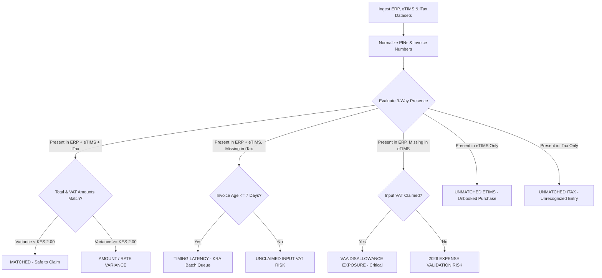

# Reconix — Kenyan VAT 3-Way Reconciliation & Audit Evidence Platform

---

## 📌 Executive Overview

**Reconix** is an independent, read-only **VAT Reconciliation & Evidence Platform** engineered specifically for Kenyan VAT-registered taxpayers, corporate CFOs, and tax advisory practitioners (ICPAK accountants, audit firms, and tax consultants).

The platform addresses a critical, recurring data integrity failure in Kenya’s tax ecosystem: the mismatch between real-time **eTIMS/TIMS electronic invoices**, internal **ERP/POS accounting ledgers** (QuickBooks, SAP, Sage, Tally), and auto-populated **iTax VAT returns** (Form VAT 7).

Reconix automatically ingests purchase datasets from all three sources, executes a **deterministic 3-way matching algorithm**, categorizes discrepancies into compliance risk categories, surfaces tax liabilities, and generates timestamped **Reconciliation Certificates** and **KRA iTax-ready upload schedules**.

---

## 🎯 The Systemic Problem Reconix Solves

Kenyan VAT-registered businesses face a systemic data gap caused by latency, processing delays, and system mismatches across three disconnected data flows:

```
┌───────────────────────────┐      ┌───────────────────────────┐      ┌───────────────────────────┐
│     1. eTIMS / TIMS       │      │   2. Internal ERP Books   │      │    3. KRA iTax Portal     │
│  Real-Time Transmitted    │  VS  │  Booked Purchases, POS,   │  VS  │   Auto-Populated VAT 7    │
│    Electronic Invoices    │      │    Accounting Journals    │      │    Section B Schedules    │
└───────────────────────────┘      └───────────────────────────┘      └───────────────────────────┘
```

### Key Domain Friction Points:
1. **Batch Processing Latency**: Invoices correctly generated on eTIMS by suppliers often take up to 7 days to auto-populate onto the buyer’s iTax Section B schedule due to KRA server queue latency. Taxpayers filing early risk claiming input VAT that iTax hasn't yet indexed.
2. **Unclaimed Input VAT Risk**: Invoices correctly transmitted via eTIMS and recorded in internal books frequently get omitted from the pre-filled iTax return. Taxpayers fail to claim legitimate input VAT credit, directly inflating their tax bill.
3. **KRA VAA (Value Added Automated Audit) Penalty Disallowance**: Claiming input VAT in internal books for purchases where the supplier failed to issue an eTIMS invoice triggers automated VAA discrepancy notices, leading to 100% input VAT disallowance, 20% statutory penalties, and monthly interest.
4. **Section 16(1) 2026 Corporate Income Tax Expense Disallowance**: Under the 2026 Tax Laws Amendment, Corporate Income Tax (IT2C) expense deductions are disallowed for any business purchase lacking a valid eTIMS control code/QR signature, regardless of whether the supplier is VAT-registered.

---

## ⚙️ How Reconix Works: The 3-Way Matching Engine

### 1. Data Normalization & Multi-Key Indexing
When datasets are ingested (via native CSV uploads or pre-loaded Kenyan market scenarios), Reconix normalizes raw records:
- **KRA PIN Normalization**: Strips spaces, hyphens, and lowercase characters (e.g., `p-051234567a` ➔ `P051234567A`).
- **Invoice Number Normalization**: Cleans prefix variations and leading zeros (e.g., `INV/2026/001001` ➔ `INV1001`).
- **Composite Matching Key**: Generates a unique key `SUPPLIER_PIN + '_' + INVOICE_NUMBER` to evaluate invoice existence across all three systems simultaneously.

### 2. Multi-Key Deterministic Matching Logic



---

## 📊 Exception Classification & Risk Hierarchy

Reconix categorizes every invoice item into one of six distinct status categories, assigned an explicit Risk Level (`Safe`, `Low`, `Medium`, `High`, `Critical`):

| Exception Status Tag | Status Description | Risk Level | Financial & Compliance Impact | Practitioner Action Plan |
| :--- | :--- | :---: | :--- | :--- |
| **`MATCHED`** | Invoice present in ERP, eTIMS, and iTax with matching amounts. | 🟢 `SAFE` | Cleared for filing in Section B. Zero penalty exposure. | Include in monthly VAT 7 return. |
| **`TIMING LATENCY`** | Transmitted on eTIMS <=7 days ago; queued in KRA auto-population batch. | 🔵 `LOW` | Temporary delay. Input VAT valid but not yet visible on iTax. | Wait for nightly iTax batch refresh or insert eTIMS Control Code. |
| **`UNCLAIMED INPUT VAT`** | Valid eTIMS invoice present in books & eTIMS, but omitted from iTax schedule. | 🟡 `HIGH` | Financial loss: Legitimate input VAT credit omitted from return. | Manually insert eTIMS invoice entry into iTax VAT 7 Section B schedule. |
| **`VAA DISALLOWANCE EXPOSURE`** | Input VAT claimed in ERP, but supplier PIN generated no eTIMS invoice. | 🔴 `CRITICAL` | Disallowance of input VAT claim + 100% VAA audit penalty. | Demand supplier eTIMS transmission; exclude claim if supplier fails. |
| **`EXPENSE VALIDATION RISK (2026)`** | Booked purchase lacking eTIMS QR/Control Code. | 🟠 `HIGH` | 30% Corporate Income Tax liability (Section 16(1) deduction rejection). | Demand eTIMS credit note/invoice or record non-deductible tax expense. |
| **`AMOUNT / RATE VARIANCE`** | 3-way present, but amounts differ across ledgers. | 🟡 `MEDIUM` | Variance in taxable base or 16%/8%/0% rate miscalculation. | Verify credit notes or rounding with supplier before filing. |

---

## 🛠️ Main Platform Modules & Capabilities

### 1. Executive KPI Dashboard & Visual Analytics
- **20th Monthly Filing Countdown Timer**: Real-time countdown to the 20th KRA VAT 7 lock-in deadline.
- **Financial Risk Metrics**:
  - **Claimable Input VAT (Matched)**: Input VAT cleared for iTax Section B filing.
  - **Unclaimed Input VAT Risk**: Money left on the table due to iTax omission.
  - **2026 Expense Disallowance Risk**: Booked purchases lacking eTIMS codes.
  - **Section 16(1) Corp Tax Risk**: Calculated **30% Resident Corporate Income Tax liability** exposure.
- **Interactive Charts (`fl_chart`)**: 3-Way Matching ratio pie chart & exception category distribution bar chart.

### 2. Multi-Source Ingestion Hub & Pre-Loaded Kenyan Datasets
- **Custom CSV Parsers**: Drag-and-drop file uploaders for eTIMS, ERP, and iTax CSV files.
- **Pre-Configured Market Datasets**:
  1. *Apex Logistics Kenya Ltd*: Mid-month run featuring eTIMS batch delays (Crown Paints), fuel 8% VAT, and Bamburi Cement unclaimed VAT.
  2. *Nairobi Commercial Retailers Ltd*: High VAA exposure with KES 624,500 penalty risk and missing supplier PINs.
  3. *Rift Valley Agriculture Exporters*: 100% matched baseline with zero-rated input VAT export claims.

### 3. 3-Way Comparative VAT Ledger & Bulk Action Bar
- **Multi-Key Search Bar & Status Chips**: Search by PIN, Invoice #, Supplier Name, or filter by exception status chips.
- **Multi-Select Checkboxes**: Select individual rows or all filtered invoices.
- **Top Bulk Action Bar**: Single-click practitioner tagging (`VERIFIED_FOR_ITAX`, `DEMAND_ETIMS_CODE`) and batch exporting across multiple invoices.

### 4. Inspector Dialog & eTIMS QR Code Verifier
- **Side-by-Side 3-Way Comparison**: Inspect line-item fields for ERP, eTIMS, and iTax records.
- **Interactive eTIMS QR Inspector**: Parses eTIMS Control Codes (`Branch Code - Serial - Sequence`) and simulates official KRA portal verification links (`https://etims.kra.go.ke/verify/...`).
- **Auditor Resolution & Tagging**: Apply status tags and record custom defense notes for audit trails.

### 5. Official KRA iTax Section B CSV Exporter
- **Direct iTax Upload CSV**: Exports sanitized CSV files formatted specifically for the official KRA iTax Section B Input VAT schedule upload schema (`Supplier KRA PIN`, `Supplier Name`, `Invoice Number`, `Invoice Date (DD/MM/YYYY)`, `Description`, `Taxable Value`, `VAT Amount`, `eTIMS Control Code`).
- **Safety Filters**: Excludes unverified or high-risk VAA exposure invoices to prevent automated KRA audit penalty disallowances.

### 6. Audit Evidence Hub & PDF Certificate Generator
- **SHA-256 Non-Mutability Digest**: Computes a unique cryptographic hash string over taxpayer PIN, tax period, invoice count, and generation timestamp.
- **Downloadable PDF Certificates (`PdfCertificateService`)**: Generates official timestamped **VAT Audit Evidence Certificates** complete with executive reconciliation metrics, Section 16(1) corporate tax breakdown, and exception schedules.

### 7. Advisor & Practice Portal
- **Multi-Client Portfolio Directory**: Practice management dashboard for tax consultants managing multiple corporate PINs, displaying readiness status badges (`READY_TO_FILE`, `READINESS_REVIEW`, `HIGH_RISK`).

---

## 📈 Operational Reconciliation Workflow

```
┌────────────────────────────────────────────────────────────────────────────────────────────────┐
│ STEP 1: INGEST DATASETS                                                                        │
│ Ingest ERP purchase register, eTIMS tax invoice dump, and iTax auto-populated CSV schedule.   │
└───────────────────────────────┬────────────────────────────────────────────────────────────────┘
                                │
                                ▼
┌────────────────────────────────────────────────────────────────────────────────────────────────┐
│ STEP 2: RUN 3-WAY MATCHING ENGINE                                                              │
│ Execute ReconciliationEngine.reconcile() to match records by normalized supplier PIN & inv #.  │
└───────────────────────────────┬────────────────────────────────────────────────────────────────┘
                                │
                                ▼
┌────────────────────────────────────────────────────────────────────────────────────────────────┐
│ STEP 3: REVIEW EXECUTIVE DASHBOARD & EXPOSURE METRICS                                          │
│ Check claimable VAT, unclaimed VAT at risk, and 30% Section 16(1) Corporate Tax exposure.      │
└───────────────────────────────┬────────────────────────────────────────────────────────────────┘
                                │
                                ▼
┌────────────────────────────────────────────────────────────────────────────────────────────────┐
│ STEP 4: INSPECT & RESOLVE DISCREPANCIES IN LEDGER                                              │
│ Filter by VAA Risk or Unclaimed Input VAT. Bulk-tag verified items or demand supplier eTIMS.   │
└───────────────────────────────┬────────────────────────────────────────────────────────────────┘
                                │
                                ▼
┌────────────────────────────────────────────────────────────────────────────────────────────────┐
│ STEP 5: EXPORT SANITIZED ITAX SECTION B CSV SCHEDULE                                           │
│ Export the cleared input VAT CSV schedule and upload directly to KRA iTax portal before 20th.  │
└───────────────────────────────┬────────────────────────────────────────────────────────────────┘
                                │
                                ▼
┌────────────────────────────────────────────────────────────────────────────────────────────────┐
│ STEP 6: GENERATE IMMUTABLE PDF AUDIT EVIDENCE PACK                                             │
│ Download timestamped PDF certificate with SHA-256 hash digest for KRA audit defense.           │
└────────────────────────────────────────────────────────────────────────────────────────────────┘
```

---

## 🧪 Verification & Build Status

- **Automated Unit Tests (`flutter test`)**: **4/4 Passed (100% Success)** (`ReconciliationEngine` 3-way matching rules + `ITaxExportService` KRA CSV generator).
- **Static Analysis (`flutter analyze`)**: **`No issues found!`** (0 errors, 0 warnings, 0 lints).
- **Production Web Build (`flutter build web`)**: **Compiled successfully to JavaScript** in `build/web/`.
